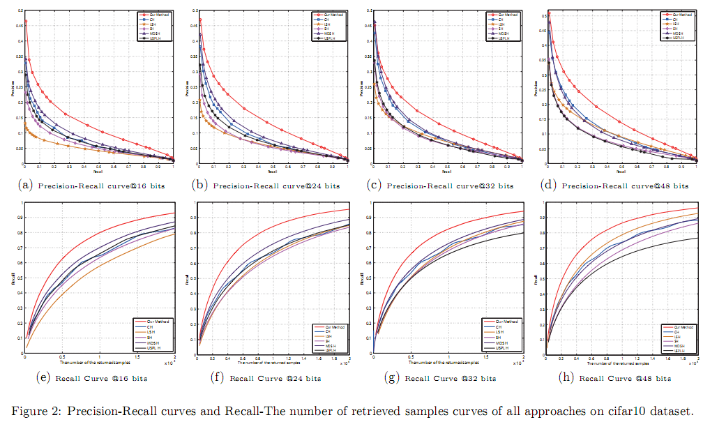
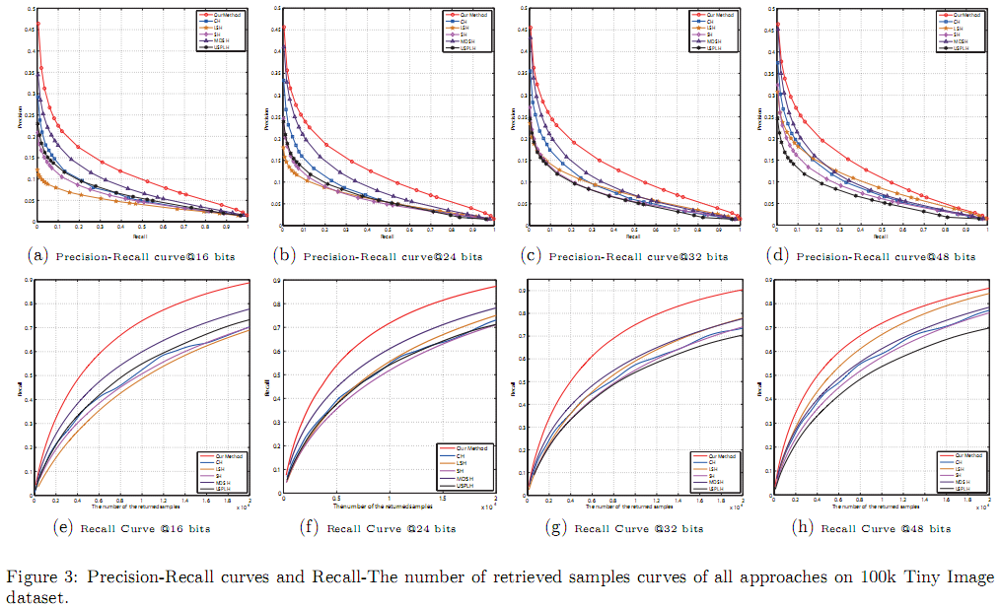

# sparse-reconstruction-hashing
The code of "Learning Hash Functions Using Sparse Reconstruction"

<p align="center"></p>

<p align="center"></p>

```
@inproceedings{yuan2014learning,
  title={Learning Hash Functions Using Sparse Reconstruction},
  author={Yuan, Yong and Lu, Xiaoqiang and Li, Xuelong},
  booktitle={Proceedings of International Conference on Internet Multimedia Computing and Service},
  pages={14},
  year={2014},
  organization={ACM}
}
```
